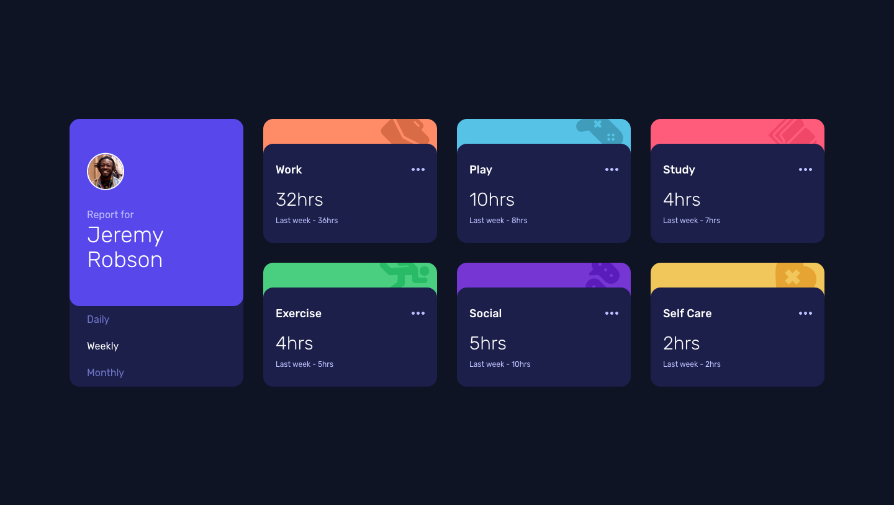
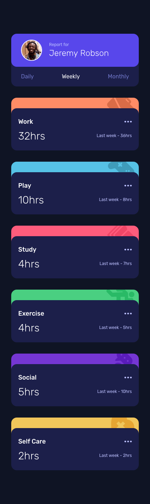

# Frontend Mentor - Time tracking dashboard solution

This is a solution to the [Time tracking dashboard challenge on Frontend Mentor](https://www.frontendmentor.io/challenges/time-tracking-dashboard-UIQ7167Jw). Frontend Mentor challenges help you improve your coding skills by building realistic projects. 

## Table of contents

- [Overview](#overview)
  - [The challenge](#the-challenge)
  - [Screenshot](#screenshot)
  - [Links](#links)
- [My process](#my-process)
  - [Built with](#built-with)
  - [What I learned](#what-i-learned)
- [Author](#author)

## Overview

### The challenge

Users should be able to:

- View the optimal layout for the site depending on their device's screen size
- See hover states for all interactive elements on the page
- Switch between viewing Daily, Weekly, and Monthly stats

### Screenshot

### Links

- Solution URL: [Github](https://github.com/PragmaticCreator/bookmarks)
- Live Site URL: [Site](https://bookmarkspa.netlify.app/)

## My process

### Built with

- Semantic HTML5 markup
- Tailwind CSS
- Flexbox
- Mobile-first workflow
- [React](https://reactjs.org/) - JS library
-[Zustand](https://github.com/pmndrs/zustand) - State management library
-[Framer Motion](https://www.framer.com/) - Animation Library
- [Tailwind](https://tailwindcss.com/) - For styles
- [Vite](https://vitejs.dev/) - Build tool

### What I learned

- How to use framer motion for basic animations.
- Css grids.
- State management.

## Author

- Frontend Mentor - [@PragmaticCreator](https://www.frontendmentor.io/profile/PragmaticCreator)
